# Culinary-Assistant
Chatbot created to find recipes based on given ingredients and to conduct general conversation. BEng Thesis.
It uses Machine Learning models to answer questions, generate some ordinary sentences and find best lines in corpora to answer some small talk.
It communicates in Polish.

This is a shared project of [Zofia Kochutek](https://github.com/zofiakochutek) and [Paulina Landkocz](https://github.com/PaulinaLa).

## Setup

The simplest way is to run this project on 
[Google Colabolatory](https://drive.google.com/drive/folders/1bY5pNjg25IBK4m7QCM0eg1oZLlYjkYIB?usp=sharing). 
To do so, one just need to go to 'src/discord_communicator.ipynb' and go through all cells present there.

## The chatbot knows how to
--- 
### Greet the user
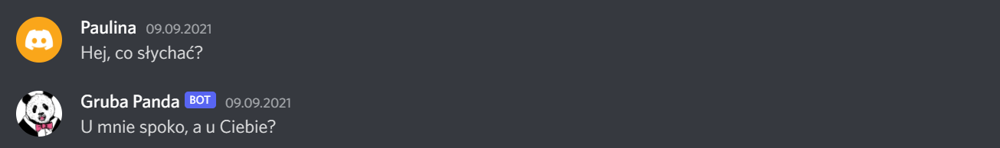 
 
* User: How are you?
* Bot: Im fine, how are you?

&nbsp;

--- 
### Introduce themself

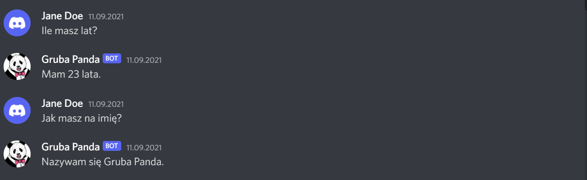
* User: How old are you?
* Bot: I'm 23.
* User: What is your name?
* Bot: My name is Gruba Panda.

&nbsp;

---
### Answer general questions
#### In this mode chatbot uses the [Polish SQuAD2.0](https://huggingface.co/henryk/bert-base-multilingual-cased-finetuned-polish-squad2) model from the HuggingFace.
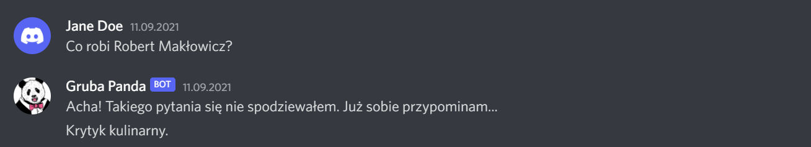

* User: What does Robert Makłowicz do?
* Bot: Ah! I did not expect such a question. I remember now... Food critic.

&nbsp;

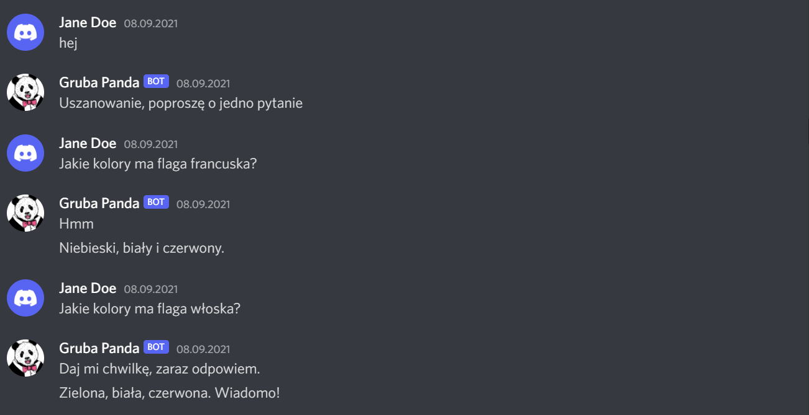 
* User: Hello
* Greetings, one question please
* User: What colours is the French flag?
* Bot: Hmmm
* Bot: Blue, white and red.
* User: What colors is the Italian flag?
* Bot: Give me a minute and I'll answer.
* Bot: Green, white and red. Obviously!

&nbsp;

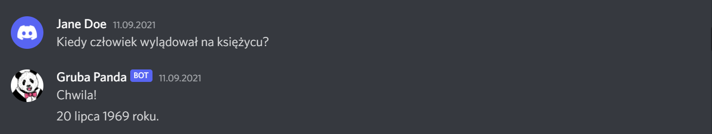 
* User: When did man land on the moon?
* Bot: One second! July 20, 1969.

&nbsp;

---
### Answer personal questions
#### In this mode chatbot uses [HerBERT](https://huggingface.co/allegro/herbert-large-cased).

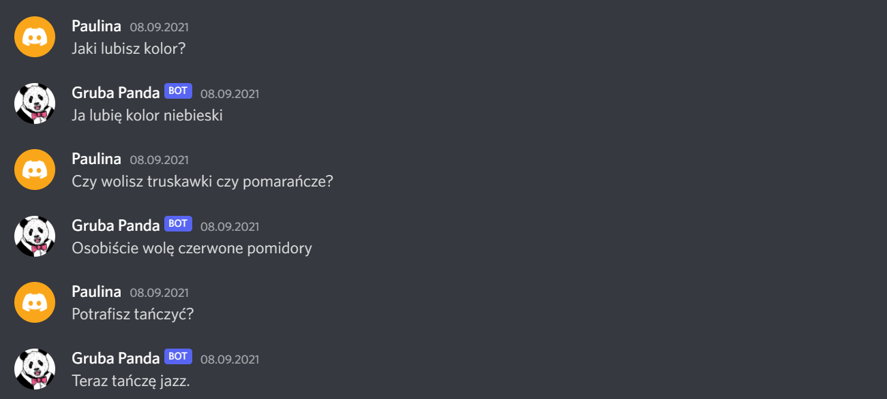 
* User: What colour do you like?
* Bot: I like blue colour.
* User: Do you prefer strawberries or oranges?
* Bot: I personally prefer red tomatoes.
* User: Can you dance?
* Bot: Now I dance jazz.

&nbsp;

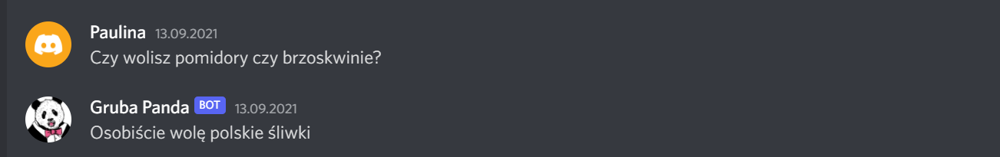 
* User: Do you prefer tomatoes or peaches?
* Bot: Personally I prefer polish plumps.

&nbsp;

---
### Find the recipe based on given ingredients
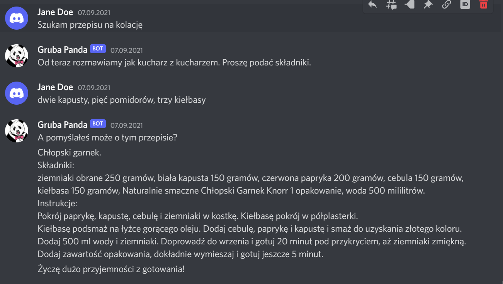
* User: I'm looking for a recipe for dinner
* Bot: From now on, we talk like a cook to a cook. Give me the ingredients please.
* User: two cabbages, five tomatoes, three sausages
* Bot:\
Have you thought about this recipe?\
Peasant pot.\
Ingredients:\
peeled potatoes 250 grams, white cabbage 150 grams, red pepper 200 grams, onion 150 grams, sausage 150 grams, Naturally tasty Knorr Peasant Pot 1 pack, water 500 ml.\
Instructions:\
Dice the peppers, cabbage, onions and potatoes. Cut the sausage into half-slices.
Fry the sausage with a tablespoon of hot oil. Add the onion, pepper and cabbage and fry until golden brown.
Add 500 ml of water and potatoes. Make it boil and keep boiling, covered, for 20 minutes, until the potatoes are soft.
Add the contents of the package, mix thoroughly and cook for another 5 minutes./
I wish you a lot of fun cooking!

&nbsp;

---
### Talk about his creators

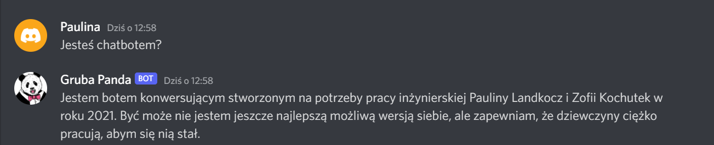
* User: Are you a chatbot?
* Bot: I am a converting bot created for the engineering work of Paulina Landkocz and Zofia Kochutek in 2021. Maybe I'm not the best possible version of myself yet, but I assure you that the girls work hard to make me one.

&nbsp;

---
### Have a small talk with the user

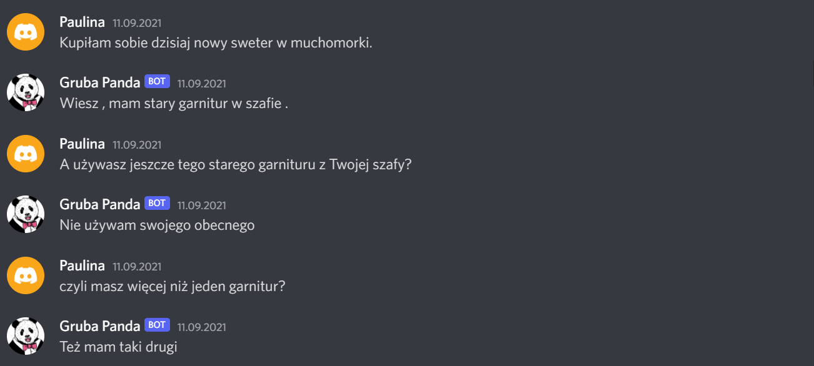 
* User: I bought a toadstool sweater today.
* Bot: I have an old suit in the closet.
* User: And do you still use it?
* Bot: I'm not using my current one.
* User: So do you have more than one?
* Bot: I also have a second.

&nbsp;

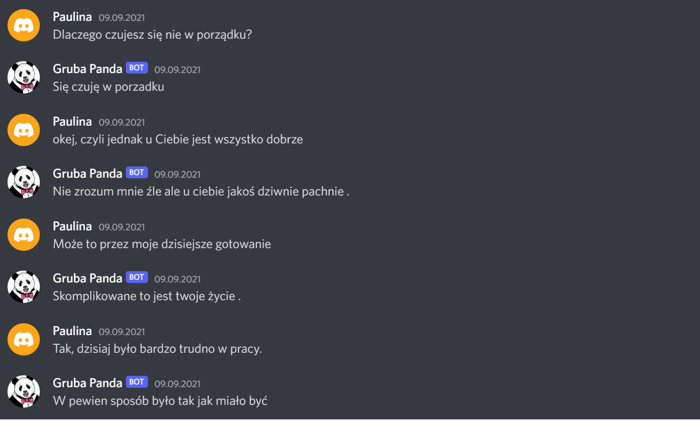
* User: Why do you feel not okay?
* Bot: I feel fine.
* User: Okay, so you are fine after all.
* Bot: Don't get me wrong but there is some kind of strange smell at your place.
* User: Maybe it comes from my today's cooking.
* Bot: Complicated, I mean your life.
* User: Yes, today was a really hard day at work.
* Bot: In a way it was as it supposed to be.

&nbsp;

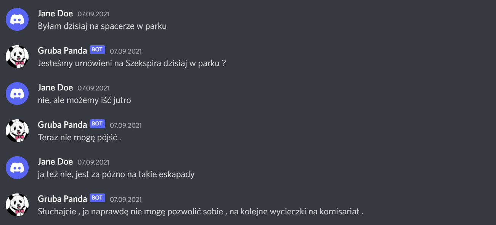 
* User: I had a walk in a park today.
* Bot: Do we have the Shakespeare appointment in the park today?
* User: No, but we can go tommorow
* Bot: Now I can't go.
* User: Me neither, it's too late for such escapades
* Bot: Listen, I really can't let myself another trip to the police station.

&nbsp;

